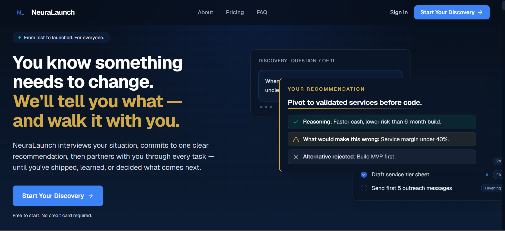

# NeuraLaunch
NeuraLaunch is an AI-powered venture-building platform for founders, especially early-stage or solo/small-team founders, who are trying to move from a vague idea, no idea, or a stalled project into a validated and launched product. It guides users through adaptive discovery interviews, turns the resulting belief state into a recommendation and execution roadmap, supports task-level progress with research/composer/packager/coach tools, and can generate validation landing pages plus reports from real demand signals. It is built for ambitious founders who need structured strategic judgment, execution support, and continuity across multiple ventures rather than just a one-off startup idea validator.

## Tech Stack

NeuraLaunch is built with Next.js, TypeScript, Tailwind CSS, and shadcn/ui on the frontend, with Prisma and PostgreSQL powering the data layer. It uses NextAuth for authentication, Paddle for billing, Inngest for durable background workflows, Upstash Redis for session state, and Zod for schema validation. The AI layer is built on the Vercel AI SDK with Anthropic Claude, Gemini fallback support, and external research integrations through Tavily and Exa.

## Screenshot

## Live Site
Visit NeuraLaunch: https://startupvalidator.app
